# My Home Network

Contains the architecture of my home network, for planning and configuring. 

Also, by exposing the topolgy in public, I hope any glaring holes or similar may be caught out by others, as well as potential suggestions in general. In all examples, the IP addresses are random, but consistent and on the same subnet, where they seem to be.

## Current Setup

Fiber from my ISP into an ISP-own modem/switch/wifi-AP combo, which goes to my primary PC and my server.

## The Plan

Setup my Ubuntu server with a NIC in it (total 3 RJ45 including default) as a router + firewall + VPN (replace my pfsense box!)

### Phase 1

My server has a NIC with two ports in it. Use it as a router (first step) to make a new network: `192.168.30.0/24` , connected to a cheapo netgear "WiFi router" gor guest Wifi via the AP.

### Phase 2

Try and setup firewall rules preventing it from accessing 192.168.128.0/24 except for the ISP modem out to internet. TBD: Can I prevent it from accessing 192.168.128.3, i.e. the server IP? (e.g. if I run a webserver on it). Should be able to if I configure the `192.168.30.0/` route correctly.

### Phase 3 

Setup a VPN connection (OpenVPN? TBD) from my server to a remote VPS in a different country. Route all "Guest wifi" traffic through the VPN connection by default (i.e. at router level). 
